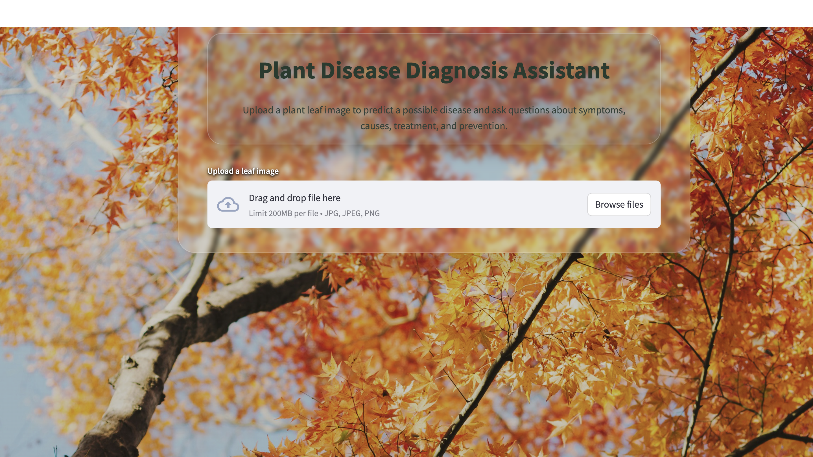
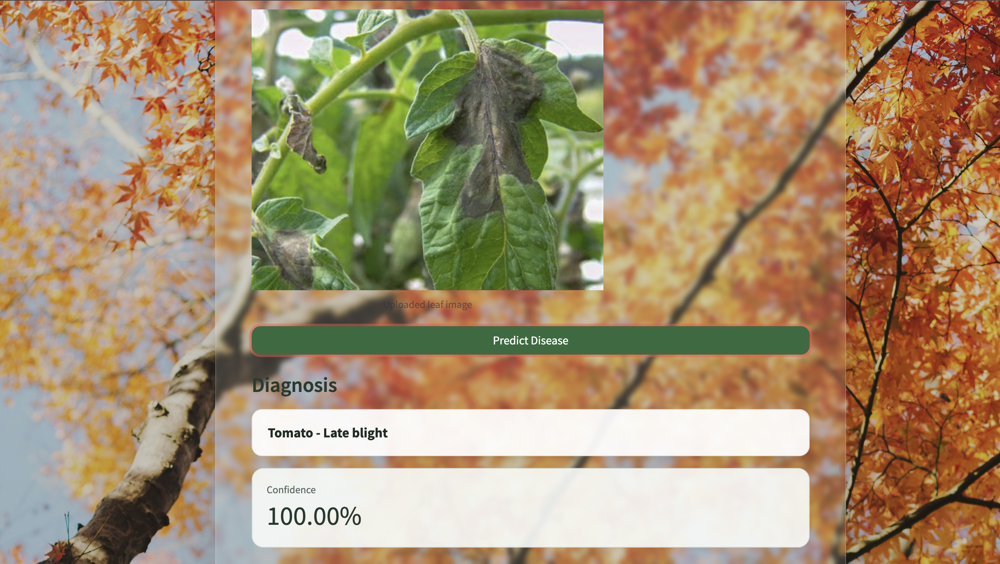
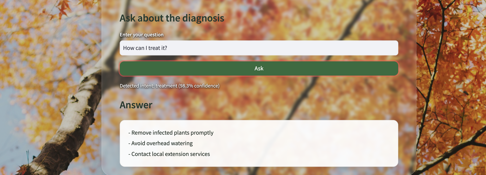

# Plant Disease Diagnosis Assistant

## Overview

Plant Disease Diagnosis Assistant is an end-to-end machine learning application for plant leaf disease classification and intent-aware question answering.

The system combines image classification models, a structured plant disease knowledge base, and a DistilBERT intent classifier. A Streamlit frontend communicates with a FastAPI backend that serves the trained models through REST endpoints.

The application supports image-based disease prediction followed by questions about symptoms, causes, treatment, prevention, and general diagnosis information.

---

## Live Demo

Try the deployed application:

**[Open Plant Disease Diagnosis Assistant](https://plant-disease-diagnosis-dai.streamlit.app)**

The Streamlit frontend is publicly hosted on **Streamlit Community Cloud** and communicates with a containerized **FastAPI** inference service deployed on **Google Cloud Run**.

Users can upload a plant leaf image, receive a disease prediction with confidence, and ask follow-up questions about symptoms, causes, treatment, and prevention.

---

## Demo

The Streamlit web application provides an interactive workflow for plant disease diagnosis and follow-up question answering.

### Home

Upload a plant leaf image through the Streamlit interface.



### Disease Prediction

The uploaded image is classified using the fine-tuned ResNet18 model, returning the predicted disease and confidence score.



### Question Answering

Users can ask follow-up questions about the diagnosis. DistilBERT identifies the question intent and retrieves the corresponding information from the structured disease database.



---

## Features

- Plant leaf disease classification from images
- Custom CNN model training
- Transfer learning with ResNet18 and MobileNetV3
- Hyperparameter tuning with Optuna
- Model comparison using accuracy, macro F1 score, model size, and inference latency
- Structured disease database containing symptoms, causes, treatment, and prevention information
- Question intent classification using DistilBERT
- Intent-aware question answering using DistilBERT and the disease database
- REST API for model serving using FastAPI
- Interactive web frontend built with Streamlit
- Containerized inference environment using Docker
- CPU-optimized Docker image for lightweight deployment
- FastAPI backend deployed on Google Cloud Run
- Public frontend deployed on Streamlit Community Cloud
- Environment-based API configuration for local and cloud deployment

---

## System Architecture

```text
                          User
                           │
                           ▼
               ┌───────────────────────┐
               │  Streamlit Frontend   │
               │  Community Cloud      │
               └───────────┬───────────┘
                           │ HTTPS
                           ▼
               ┌───────────────────────┐
               │   Google Cloud Run    │
               │                       │
               │   FastAPI Backend     │
               └───────┬────────┬──────┘
                       │        │
                POST /predict   POST /ask
                       │        │
                       ▼        ▼
                   ResNet18  DistilBERT
                       │        │
                       │        ▼
                       │   Intent Prediction
                       │        │
                       └────┬───┘
                            ▼
                  Plant Disease Database
                            │
                            ▼
                   Diagnosis / Answer
```

The frontend and backend are deployed independently.

The Streamlit application communicates with the FastAPI backend through HTTPS, while the backend loads the trained ResNet18 and DistilBERT models inside a Docker container running on Google Cloud Run.

The backend URL is supplied to the frontend through the `API_URL` environment variable, allowing the same frontend code to work with both local and cloud deployments.

---

## Dataset

This project uses the PlantVillage dataset.

The raw image dataset is not included in this repository because of its size.

Expected dataset directory:

```text
PlantVillage-Dataset/raw/color
```

The dataset contains plant leaf images across multiple plant species and disease classes.

---

## Project Structure

```text
plant-disease-diagnosis-assistant/
├── README.md
├── requirements.txt
├── requirements-api.txt
├── requirements-frontend.txt
├── .gitignore
├── .dockerignore
├── Dockerfile
├── demo.py
│
├── app/
│   ├── __init__.py
│   └── main.py
│
├── frontend/
│   └── streamlit_app.py
│   └── requirements.txt
│
├── .streamlit/
│   └── config.toml
│
├── assets/
│   ├── background.jpg
│   ├── demo_home.png
│   ├── demo_prediction.png
│   └── demo_qa.png
│
├── notebooks/
│   └── Plant Health AI Assistant.ipynb
│
├── src/
│   ├── image_inference.py
│   ├── diagnosis.py
│   ├── intent_classifier.py
│   ├── qa.py
│   └── models.py
│
├── data/
│   ├── plantvillage_disease_database.json
│   ├── plant_intent_dataset_500.csv
│   └── class_names.json
│
├── results/
│   ├── loss.png
│   ├── accuracy.png
│   ├── bert_intent_results.csv
│   ├── flexible_cnn_loss.png
│   ├── image_model_comparison.csv
│   ├── mobilenetv3_loss.png
│   ├── resnet18_loss.png
│   └── sample_qa_output.md
│
├── logs/
│   └── training_log.csv
│
├── sample_images/
│   └── sample_leaf.jpg
│
└── models/
    ├── flexible_cnn_best.pth
    ├── resnet18_best.pth
    ├── mobilenet_v3_best.pth
    └── intent_classifier/
```

---

## Models

This project compares three image classification architectures.

### FlexibleCNN

FlexibleCNN is a custom convolutional neural network with tunable architecture parameters, including:

- number of convolutional layers
- number of filters
- kernel sizes
- dropout rate
- fully connected layer size

### ResNet18

ResNet18 is used as a pretrained transfer learning model and fine-tuned for plant disease classification.

The fine-tuned ResNet18 model is used by the FastAPI inference service.

### MobileNetV3

MobileNetV3 is used as a lightweight pretrained transfer learning model.

It is included as a smaller and faster model candidate for efficient inference.

---

## Question Answering Pipeline

After a disease class is predicted from an image, the user can ask a natural-language question about the diagnosis.

```text
Leaf image
    │
    ▼
ResNet18
    │
    ▼
Predicted disease
    │
    ├─────────────────────────────┐
    │                             │
    │                         User question
    │                             │
    │                             ▼
    │                         DistilBERT
    │                             │
    │                             ▼
    │                      Predicted intent
    │                             │
    └──────────────┬──────────────┘
                   ▼
          Disease information database
                   │
                   ▼
                 Answer
```

The question intent classifier predicts one of five categories:

```text
symptoms
cause
treatment
prevention
general
```

---

## REST API

The backend is implemented with FastAPI.

Interactive Swagger documentation is available at `/docs` while the API is running.

### Endpoints

#### Health Check

```http
GET /health
```

Example response:

```json
{
  "status": "healthy"
}
```

#### Disease Prediction

```http
POST /predict
```

Accepts a plant leaf image and returns the predicted class, confidence score, and class probabilities.

Example response:

```json
{
  "class_index": 30,
  "class_name": "Tomato___Late_blight",
  "confidence": 0.99
}
```

#### Question Answering

```http
POST /ask
```

The `class_name` returned by `/predict` can be passed to `/ask` together with a user question.

Example request:

```json
{
  "class_name": "Tomato___Late_blight",
  "question": "How can I prevent this disease?"
}
```

Example response:

```json
{
  "question": "How can I prevent this disease?",
  "intent": "prevention",
  "intent_confidence": 0.98,
  "answer": "- Use healthy transplants\n- Destroy volunteer tomatoes and potatoes\n- Monitor disease alerts"
}
```

---

## Results

### Image Classification Results

| Model | Test Accuracy | Macro Recall | Macro F1 | Model Size (MB) | Mean Latency (ms) |
|---|---:|---:|---:|---:|---:|
| FlexibleCNN2 | 96.15% | 96.15% | 96.44% | 1.03 | 1.71 |
| ResNet18 Stage2 | 99.39% | 99.39% | 99.44% | 42.78 | 6.04 |
| MobileNetV3 Stage2 | 97.45% | 97.45% | 97.64% | 6.06 | 6.34 |

### Intent Classification Results

| Model | Test Accuracy | Test Precision | Test Recall | Test F1 |
|---|---:|---:|---:|---:|
| DistilBERT | 94.92% | 95.38% | 95.00% | 94.85% |

### Training Curves

Training and validation loss curves are saved under:

```text
results/
```

including model-specific loss curves and evaluation outputs.

---

## Docker Deployment Optimization

The initial Docker image included both training and inference dependencies, resulting in a large deployment image.

To create a lighter runtime environment:

- training and notebook dependencies were separated from inference dependencies
- a dedicated API requirements file was introduced
- CPU-only PyTorch was used for inference
- unused training tools were excluded from the deployment container

| Docker Image | Purpose | Disk Usage | Content Size |
|---|---|---:|---:|
| `plant-disease-api` | Full environment | 9.84 GB | 3.52 GB |
| `plant-disease-api-light` | CPU inference environment | 2.21 GB | 623 MB |

The optimized image preserves the `/health`, `/predict`, and `/ask` functionality while substantially reducing deployment overhead.

---

## Cloud Deployment

The application is deployed using separate frontend and backend services.

### Backend

The FastAPI inference service is packaged as a Docker container and deployed to **Google Cloud Run**.

The backend exposes the following endpoints:

```text
GET  /health
POST /predict
POST /ask
```

The Cloud Run service is configured with:

```text
Region:        us-west2
CPU:           1
Memory:        2 GiB
Min instances: 0
Max instances: 1
```

Setting the minimum number of instances to zero allows the backend to scale down when inactive, making the deployment suitable for a low-traffic demonstration application.

### Frontend

The Streamlit frontend is deployed on **Streamlit Community Cloud** and communicates with the Cloud Run backend over HTTPS.

```text
Browser
   │
   ▼
Streamlit Community Cloud
   │
   │ HTTPS
   ▼
Google Cloud Run
   │
   ▼
FastAPI
   │
   ├── ResNet18 image classifier
   ├── DistilBERT intent classifier
   └── Structured disease database
```

### Live Application

[Launch the live application](https://plant-disease-diagnosis-dai.streamlit.app)

---

## Model Weights

Saved model weights are not included in the repository because the `models/` directory is ignored by `.gitignore`.

To reproduce the results, either run the training notebook or place trained weights under:

```text
models/
├── flexible_cnn_best.pth
├── resnet18_best.pth
├── mobilenet_v3_best.pth
└── intent_classifier/
```

The Docker inference service requires:

```text
models/
├── resnet18_best.pth
└── intent_classifier/
```

---

## How to Run

### 1. Clone the Repository

```bash
git clone https://github.com/DAI0915/plant-disease-diagnosis-assistant.git
cd plant-disease-diagnosis-assistant
```

### 2. Install Development Dependencies

```bash
pip install -r requirements.txt
```

---

### 3. Prepare the Dataset

Download the PlantVillage dataset and place it under:

```text
PlantVillage-Dataset/
└── raw/
    └── color/
        ├── Apple___Apple_scab/
        ├── Grape___Black_rot/
        ├── Tomato___Early_blight/
        └── ...
```

The experiment notebook expects:

```text
PlantVillage-Dataset/raw/color
```

---

### 4. Prepare Model Weights

Either train the models using the notebook or place trained weights under:

```text
models/
├── flexible_cnn_best.pth
├── resnet18_best.pth
├── mobilenet_v3_best.pth
└── intent_classifier/
```

To train models from scratch:

```python
RUN_TRAINING = True
LOAD_SAVED_MODELS = False
```

To load previously trained models:

```python
RUN_TRAINING = False
LOAD_SAVED_MODELS = True
```

---

### 5. Run the Experiment Notebook

Open:

```text
notebooks/Plant Health AI Assistant.ipynb
```

The notebook includes:

- dataset loading and preprocessing
- train / validation / test split
- FlexibleCNN training
- Optuna hyperparameter tuning
- ResNet18 and MobileNetV3 fine-tuning
- model evaluation and efficiency comparison
- disease database construction
- DistilBERT intent classification
- question answering experiments
- training log and result generation

---

### 6. Run the Command-Line Demo

Prepare a sample image under:

```text
sample_images/sample_leaf.jpg
```

Then run:

```bash
python demo.py \
  --image sample_images/sample_leaf.jpg \
  --question "How can I treat it?"
```

---

### 7. Run the FastAPI Backend Locally

Start the API directly:

```bash
uvicorn app.main:app --reload
```

The API will be available at:

```text
http://127.0.0.1:8000
```

Swagger documentation:

```text
http://127.0.0.1:8000/docs
```

---

### 8. Run the Optimized Docker Backend

Build the optimized inference image:

```bash
docker build -t plant-disease-api-light .
```

Run it on port `8001`:

```bash
docker run --rm -p 8001:8000 plant-disease-api-light
```

The API will then be available at:

```text
http://127.0.0.1:8001
```

Swagger documentation:

```text
http://127.0.0.1:8001/docs
```

---

### 9. Run the Streamlit Frontend

Install frontend dependencies:

```bash
pip install -r requirements-frontend.txt
```

Start the application:

```bash
python -m streamlit run frontend/streamlit_app.py
```

Open:

```text
http://localhost:8501
```

By default, the frontend connects to:

```text
http://127.0.0.1:8001
```

A different backend can be supplied through the `API_URL` environment variable.

Example:

```bash
API_URL=https://your-api.example.com \
python -m streamlit run frontend/streamlit_app.py
```

---

## Main Files

### `frontend/streamlit_app.py`

Interactive Streamlit interface for image upload, disease prediction, and follow-up question answering.

### `app/main.py`

FastAPI application exposing health-check, image-classification, and question-answering endpoints.

### `src/image_inference.py`

Image preprocessing and disease-classification inference utilities.

### `src/diagnosis.py`

Disease-information loading and diagnosis explanation utilities.

### `src/intent_classifier.py`

DistilBERT-based question intent classification.

### `src/qa.py`

Question answering logic connecting intent prediction with the structured disease database.

### `src/models.py`

Image model definitions and fine-tuning utilities.

### `notebooks/Plant Health AI Assistant.ipynb`

Main experiment notebook containing training, evaluation, and analysis.

### `Dockerfile`

Defines the lightweight containerized inference runtime.

---

## Limitations

- The image classifier is primarily evaluated on PlantVillage images and may not generalize equally well to real-world field conditions.
- Predictions are based on image classification and should not be treated as definitive professional diagnoses.
- Question answering is retrieval-based from a structured disease database rather than free-form medical or agricultural reasoning.
- Low-confidence or out-of-distribution images are not yet explicitly rejected.

For serious plant disease cases, users should consult a local extension service, agricultural specialist, or plant-health professional.

---

## Future Improvements

- Improve robustness on real-world leaf images outside PlantVillage
- Add top-3 disease predictions
- Add confidence-based warnings and out-of-distribution detection
- Expand the disease knowledge base and question-intent dataset
- Add automated tests and CI/CD
- Add model monitoring and inference logging
- Add model weight download or hosted model artifact support

---

## Credits

Background image: Masaaki Komori / Unsplash.